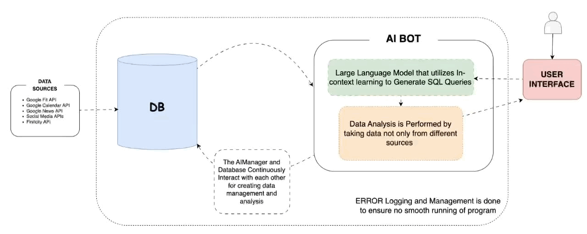

# Query Language Manager (QLM)

QLM (Query Language Manager) is an AI-powered platform designed to simplify the process of generating and executing SQL queries using natural language. Leveraging the capabilities of Google’s Generative AI (GenAI), QLM empowers both technical and non-technical users to interact with databases effortlessly and gain actionable insights in real-time. The platform integrates seamlessly with MySQL and various APIs, providing personalized data insights across domains such as finance, healthcare, and more.


## Introduction

In the realm of data management, SQL queries are fundamental for interacting with databases. However, constructing these queries often requires a solid understanding of SQL syntax, which can be a barrier for non-technical users. QLM addresses this challenge by integrating a powerful AI model that interprets plain English prompts and converts them into precise SQL commands.

## Features

- **AI-Powered Query Generation**: Utilizes Google's generative AI model to translate natural language prompts into SQL queries.
  
- **Database Management**: Connects seamlessly to MySQL databases, executes generated queries, and displays results in real-time.
  
- **User-Friendly Interface**: Built with Streamlit, QLM provides an intuitive interface for users to input prompts, view generated SQL, and manage database interactions effortlessly.
  
- **Logging and Monitoring**: Comprehensive logging ensures transparency and allows users to track executed queries and system activities.
  
- **Customizable Safety Settings**: Includes safety settings to control content generation based on specific categories like dangerous content or hate speech.

## Use Cases
*QLM is designed to be adaptable across multiple industries:*

- **Finance:** Provides financial analytics and predictions using APIs like Finitcity.
- **Healthcare:** Tracks health data and offers personalized insights via Google Fit.
- **Education:** Automates content creation and provides personalized learning recommendations using APIs like Google Calendar and News.
- **Social Media:** Analyzes posts and generates engagement suggestions using social media APIs.



Certainly! Here's the usage guide for the Query Language Manager (QLM) in Markdown format:

---

# Query Language Manager (QLM) Usage Guide

## 1. Installation

### Clone the Repository

Clone the QLM repository from GitHub using the command:
```bash
git clone https://github.com/AyonSOMADDAR/QLM.git
cd QLM
cd Query-Language-Manager-QLM-
```

### Install Dependencies

Navigate to the cloned repository folder and install the required Python dependencies using pip:
```bash
pip install -r requirements.txt
```

### Set Up Environment Variables

Create a `.env` file in the root directory (where `main.py` is located).
Define the following environment variables in the `.env` file:
```dotenv
GOOGLE_API_KEY=your_google_api_key
```
Replace `your_google_api_key` with your actual Google API key. This key is necessary for the generative AI model used in QLM.

## 2. Configuration

### Database Configuration

Ensure you have a MySQL database set up where QLM will execute SQL queries. Make note of the database host, username, password, and database name.
Inside the code add your username and password. 

## 3. Running the Application

### Launch QLM

Start the QLM application using Streamlit. Run the following command in the terminal:
```bash
streamlit run LLM.py
```

---

-*Developed by Team 3g "Genie"*

